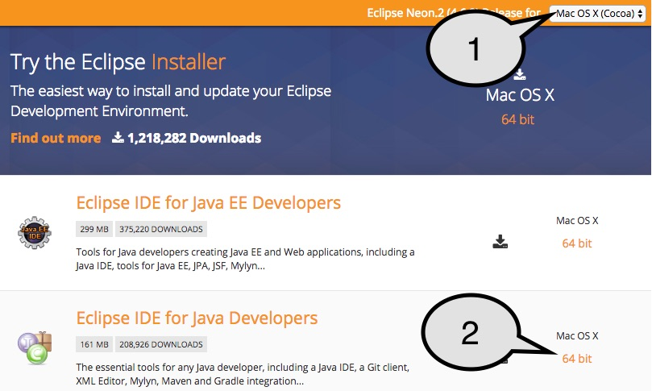
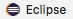

# Dive Into Microservices

We would like to thank all of you who attended the workshop. It was amazing for us to see so many people interested in the concept of microservices and how we at [Synoa](https://synoa.de) handle them in Java.

**TOC**

* [Dive Into Microservices](#dive-into-microservices)
* [Feedback](#feedback)
* [Slides](#slides)
* [Resources](#resources)
  * [Microservices](#microservices)
  * [MongoDB](#mongodb)
  * [Docker](#docker)
  * [Apache ActiveMQ](#apache-activemq)
  * [Apache Camel](#apache-camel)
  * [Maven](#maven)
* [Workshop](#workshop)
  * [FAQ &amp; help](#faq--help)
    * [How to run docker\-compose to start MongoDB &amp; ActiveMQ?](#how-to-run-docker-compose-to-start-mongodb--activemq)
    * [I don't have the database from the workshop :(](#i-dont-have-the-database-from-the-workshop-)
    * [How to see the content of MongoDB](#how-to-see-the-content-of-mongodb)
    * [How to start a microservices](#how-to-start-a-microservices)
    * [How to access the ActiveMQ web interface?](#how-to-access-the-activemq-web-interface)
  * [Projects](#projects)
    * [Microservice 0: Hello World](#microservice-0-hello-world)
    * [Microservice 1: Import customers](#microservice-1-import-customers)
    * [Microservice 2: Transform customers](#microservice-2-transform-customers)
      * [Task: fax not null](#task-fax-not-null)
    * [Microservice 3: Customer API](#microservice-3-customer-api)
      * [Task: Return a customer based on the customernumber](#task-return-a-customer-based-on-the-customernumber)
* [Software requirements](#software-requirements)
  * [General](#general)
    * [Windows](#windows)
    * [MacOS](#macos)
  * [Java 8 (JDK)](#java-8-jdk)
  * [Maven](#maven-1)
  * [Eclipse IDE](#eclipse-ide)
  * [Docker](#docker-1)
  * [Docker Compose](#docker-compose)
  * [MongoChef](#mongochef)


# Feedback

Please take 5 minutes of your time to [give us your honest feedback](https://goo.gl/forms/TqS3PU3wrg8ivkOw1).

Thank you super much!


# Slides

The slides [can be found here](http://slides.com/timpietrusky/dive-into-microservices#/). They cover the following topics:

* What is a Microservice?
  * Basic idea
  * Monolith vs Microservices
  * Amazon
  * Netflix
* Microservices at Synoa
  * At Synoa we use the following technolgies to create Microservices for mid-sized companies:
    * Maven
    * Apache Camel
    * Docker & Docker compose
    * MongoDB
    * ActiveMQ


---


# Resources

If you want to dive even deeper into the topics and technologies we used in the workshop, we got you covered:

## Microservices

* [General definition of Microservices](https://www.youtube.com/watch?v=wgdBVIX9ifA)
* [Microservices at Netflix Scale](https://www.youtube.com/watch?v=57UK46qfBLY)
* [From Monolith to Microservices at Zalando](https://www.youtube.com/watch?v=gEeHZwjwehs)
* [Microservices @ Spotify](https://www.youtube.com/watch?v=7LGPeBgNFuU)
* https://martinfowler.com/microservices


## MongoDB

A non-relational NoSQL database.

* [mongodb.com](https://www.mongodb.com)
* [MongoDB in 30 minutes](https://www.youtube.com/watch?v=pWbMrx5rVBE)
* [Introduction to NoSQL databases](https://www.youtube.com/watch?v=qI_g07C_Q5I)


## Docker

Software container, virtualization

* [docker.com](https://www.docker.com/)
* [What is Docker & Docker Containers, Images, etc?](https://www.youtube.com/watch?v=pGYAg7TMmp0)
* [An introduction to Docker Compose](https://www.youtube.com/watch?v=k900NVwFfcA)
* [Full-stack JavaScript development with Docker](https://www.youtube.com/watch?v=zcSbOl8DYXM) - It explains Docker & docker-compose in depth and it adapts to any programming language

* [Docker Hub](https://hub.docker.com/) - Repository of docker images


## Apache ActiveMQ

Message broker based on Java Message Service (JMS).

* [activemq.apache.org](http://activemq.apache.org/)
* [What is JMS?](https://www.youtube.com/watch?v=lsAyTeUUXHk) - The first 2:45 minutes are enough
  * ActiveMQ implements [JMS (Java Message Service)](https://en.wikipedia.org/wiki/Java_Message_Service).
* [Introduction to ActiveMQ](https://www.youtube.com/watch?v=s-E_V5Xyg6k) - The first 15 minutes are enough


## Apache Camel

Rule-based routing and mediation engine that provides an API to use Enterprise Integration Patterns.

* [camel.apache.org](http://camel.apache.org/)
* [Article: Introduction into ActiveMQ](https://dzone.com/articles/open-source-integration-apache)
* [Integration made easy with Apache Camel](https://www.youtube.com/watch?v=quGG8aG6ka8)
* [Free chapter of the book "Apache Camel in Action"](https://manning-content.s3.amazonaws.com/download/f/737b721-0f60-4ba9-bb1f-7a27c4a4532b/chapter1sample.pdf) or [here](https://www.manning.com/books/camel-in-action#downloads)
* [A list of all available components](http://camel.apache.org/components.html)


## Maven

Build automation and dependency management

* [maven.apache.org](https://maven.apache.org/)
* [What is Maven?](https://maven.apache.org/what-is-maven.html)


---


# Workshop

## FAQ & help

### How to run docker-compose to start MongoDB & ActiveMQ?

* Open a terminal and go into the directory where the `docker-compose.yml` file is
* Execute `docker-compose up`


### I don't have the database from the workshop :(

* Create the database `workshop` with MongoChef: File / Add Database -> `workshop`
* Import the collections (you can find them in this repository in the [database](database/) folder) by right-clicking on the database `workshop`
  * Import collections
  * Choose import format: JSON - mongo shell / 3T MongoChef / mongoexport
  * Click on the "plus" icon and add the collections (customers_import.json & customers_transform.json)
  * Click "next"
  * Click "next"
  * Click "Start Import"


### How to see the content of MongoDB

* Open the app **MongoChef**
* Create a new connection with the following data:
  * Host: `localhost`
    * Or `192.168.99.100` if you use Windows and `localhost` is not working
  * Port: 27017


### How to start a microservices

* Open a terminal and go into the directory of the microservice you want to start, for example `projects/microservice.customer.import`
* Execute `mvn spring-boot:run`


### How to access the ActiveMQ web interface?

* Open `http://localhost:8161/admin/queues.jsp` in the browser and use the following data to login:
  * Username: `admin`
  * Password: `admin`
* There you find the generated queues


---


## Projects

### Microservice 0: Hello World

Project: [microservice.hello-world](projects/microservice.hello-world)


### Microservice 1: Import customers

Project: [microservice.customer.import](projects/microservice.customer.import)

* Read a XML file with customer data
* Transform the data
* Save the data into MongoDB
* Send a message to ActiveMQ


### Microservice 2: Transform customers

Project: [microservice.customer.transform](projects/microservice.customer.transform)

* Read a message from ActiveMQ
* Read the imported customer from MongoDB
* Split the customer-list into single transformed customers
* Save the transformed customers into MongoDB

#### Task: fax not null

* If the `fax` of a customer is `null`, it should be replaced with a String of your choice

**Solution**

* You have to edit the file [TransformRawCustomerHandler](projects/microservice.customer.transform/src/main/java/de/synoa/workshop/handler/TransformRawCustomerHandler.java)
* and add the following lines before `// Add the customer to the result`:

```
if (customer.get("fax") == null) {
    customer.append("fax", "😱");
}
```


### Microservice 3: Customer API

Project: [microservice.customer.api](projects/microservice.customer.api)

* Read the transformed customers from MongoDB
* Create a REST API

#### Task: Return a customer based on the customernumber

* Implement the API to return a customer based on it's customernumber as JSON
* You can open the API by calling http://localhost:8092/api/customer/HUNG
* Hint: The 2. microservice [microservice.customer.transform](projects/microservice.customer.transform) already contains a way to read documents from MongoDB

**Solution**

* Extend the route [RestRouteBuilder.java](projects/microservice.customer.api/src/main/java/de/synoa/workshop/routes/RestRouteBuilder.java) with the following content:

```
from("direct:customer")
    // Create the query
    .bean(ReadCustomerHandler.class)

    // Read the customer from MongoDB
    .to("mongodb:mongodbConfig?database={{mongodb.database}}&collection=customers_transformed&operation=findOneByQuery")
;
```

* Create a new handler in the package `de.synoa.workshop.handler` with the name `ReadCustomerHandler` with the following content:

```
package de.synoa.workshop.handler;

import org.apache.camel.Handler;
import org.apache.camel.Header;

import com.mongodb.BasicDBObject;

public class ReadCustomerHandler {

    @Handler
    public BasicDBObject handle(@Header(value = "id") String customernumber) {
        BasicDBObject query = new BasicDBObject("customernumber", customernumber);

        return query;
    }
}
```


---


# Software requirements

The following software is required in order to follow the projects of this workshop:

## General

* Download the [docker images (activemq.tar & mongo.tar) from Google Drive](https://drive.google.com/drive/folders/0B2mQ6hpDchcQLU5ud0pMZFhPTk0?usp=sharing)
* Use these OS specific helper tools to install software more easily:

### Windows

Install the package manager [Chocolatey](https://chocolatey.org/install) by using cmd or PowerShell.

### MacOS

Install the package manager [homebrew](http://brew.sh/) by using the Terminal.


## Java 8 (JDK)
  * Windows: `choco install jdk8`
  * MacOS: `brew update && brew cask install java`
  * Linux: [Download & install](https://www.java.com/en/download/help/linux_x64_install.xml)

Verify if Java is working by running `java -version` in the terminal. It should give you an output similar to this:

```
java version "1.8.0_102"
Java(TM) SE Runtime Environment (build 1.8.0_102-b14)
Java HotSpot(TM) 64-Bit Server VM (build 25.102-b14, mixed mode)
```

## Maven
  * Windows: `choco install maven`
  * MacOS: `brew update && brew install maven`
  * Linux: `sudo apt-get install maven` (Ubuntu)

Verify if maven is working by running `mvn -version` in the terminal. It should give you an output similar to this:

```
Apache Maven 3.3.9 (bb52d8502b132ec0a5a3f4c09453c07478323dc5; 2015-11-10T17:41:47+01:00)
Maven home: /usr/local/Cellar/maven/3.3.9/libexec
Java version: 1.8.0_102, vendor: Oracle Corporation
Java home: /Library/Java/JavaVirtualMachines/jdk1.8.0_102.jdk/Contents/Home/jre
Default locale: en_US, platform encoding: UTF-8
OS name: "mac os x", version: "10.11.5", arch: "x86_64", family: "mac"
```

## Eclipse IDE
  
  1. Choose your OS
  2. Download "Eclipse IDE for Java Developers" with the link on the right
  3. Extract the archive and you are done (you can start Eclipse by clicking the  executable)

## Docker

* Windows
  * [64bit Windows 10 Pro, Enterprise and Education](https://docs.docker.com/docker-for-windows/) ★
  * [Any other Windows version](https://docs.docker.com/toolbox/toolbox_install_windows/)
* MacOS:
  * [10.11 or newer](https://docs.docker.com/docker-for-mac/) ★
  * [10.10 or older](https://docs.docker.com/toolbox/toolbox_install_mac/)
* [Linux](https://docs.docker.com/engine/installation/#/on-linux) ★

*★ Install the "stable channel"*

Verify if *docker* is working by running `docker --version` in the terminal. It should give you an output similar to this:

```
Docker version 1.13.0, build 49bf474
```
## Docker Compose

You only have to do the following steps if you have one of the following systems + version:

* Windows
  * 64bit Windows 10 Pro, Enterprice and Education
* MacOS
  * 10.11 or newer
* Linux


1. Open a terminal
2. Execute the following command

  ```
  curl -L "https://github.com/docker/compose/releases/download/1.10.0/docker-compose-$(uname -s)-$(uname -m)" -o /usr/local/bin/docker-compose
  ```
  *If you have problems using this command, [try this](https://docs.docker.com/compose/install/#/alternative-install-options).*
3. Set the permissions `chmod +x /usr/local/bin/docker-compose`

Verify if *docker-compose* is working by running `docker-compose --version` in the terminal. It should give you an output similar to this:

```
docker-compose version 1.10.0, build 4bd6f1a
```

## MongoChef

GUI for MongoDB.

*Note*: When asked while installing: You use the free version for educational purposes.

* [Windows](http://3t.io/mongochef/download/core/platform/#tab-id-1)
* [MacOS](http://3t.io/mongochef/download/core/platform/#tab-id-2)
* [Linux](http://3t.io/mongochef/download/core/platform/#tab-id-3)
